# Release Process

This document describes the automated release and publishing workflow for the Flux-Oriented Architecture framework.

## Overview

The project uses **GitHub Actions** to automatically:
- Run tests and build on every push to `main`
- Determine version bump based on commit messages
- Create Git tags
- Generate GitHub Releases
- Publish to NPM registry

## Setup Required

### 1. NPM Token

Create an NPM access token and add it to GitHub secrets:

1. **Login to NPM:**
   ```bash
   npm login
   ```

2. **Generate Granular Access Token:**
   - In the upper right corner of NPM website, click your profile picture
   - Click **"Access Tokens"**
   - Click **"Generate New Token"**
   - Configure your token:
     - **Token name**: `flux-oriented-architecture-ci` (or any descriptive name)
     - **Description**: "GitHub Actions automated publishing"
     - **Bypass two-factor authentication**: ❌ Leave unchecked (more secure)
     - **Allowed IP Ranges**: Leave empty (or add GitHub Actions IP ranges if needed)
     - **Packages and scopes**:
       - Permissions: **Read and write**
       - Select: **Only select packages and scopes**
       - Choose: `flux-oriented-architecture`
     - **Organizations**: No access (unless needed)
     - **Expiration**: Choose your preferred expiration (e.g., 1 year)
   - Review the summary and click **"Generate Token"**
   - **Copy the token immediately** (you won't be able to see it again!)

3. **Add to GitHub:**
   - Go to your repository on GitHub
   - Settings → Secrets and variables → Actions
   - Click "New repository secret"
   - Name: `NPM_TOKEN`
   - Value: paste your NPM token
   - Click "Add secret"

### 2. Repository Permissions

Ensure GitHub Actions has write permissions:

1. Go to Settings → Actions → General
2. Under "Workflow permissions", select:
   - ✅ Read and write permissions
   - ✅ Allow GitHub Actions to create and approve pull requests

## Version Bump Rules

The workflow automatically determines version bump based on commit message format:

### Major Version (1.0.0 → 2.0.0)

Breaking changes:
```bash
git commit -m "feat!: remove deprecated API"
git commit -m "BREAKING CHANGE: change plugin interface"
git commit -m "feat: add feature [breaking]"
```

### Minor Version (1.0.0 → 1.1.0)

New features:
```bash
git commit -m "feat: add PostgreSQL plugin"
git commit -m "feat(core): add environment variables"
```

### Patch Version (1.0.0 → 1.0.1)

Fixes and other changes:
```bash
git commit -m "fix: resolve memory leak"
git commit -m "docs: update README"
git commit -m "chore: update dependencies"
git commit -m "refactor: simplify code"
```

## Commit Message Format

We follow **Conventional Commits**:

```
<type>(<scope>)!: <description>

[optional body]

[optional footer]
```

### Types:
- `feat`: New feature (minor bump)
- `fix`: Bug fix (patch bump)
- `docs`: Documentation changes (patch bump)
- `style`: Code style changes (patch bump)
- `refactor`: Code refactoring (patch bump)
- `perf`: Performance improvements (patch bump)
- `test`: Test changes (patch bump)
- `chore`: Maintenance tasks (patch bump)
- `ci`: CI/CD changes (patch bump)

### Breaking Changes:
- Add `!` after type: `feat!:`
- Or include `BREAKING CHANGE:` in footer
- Or add `[breaking]` in description

## Release Workflow

### Automatic Release (on merge to main)

1. **Commit with proper message:**
   ```bash
   git commit -m "feat: add new database plugin"
   ```

2. **Push or merge to main:**
   ```bash
   git push origin main
   ```

3. **GitHub Actions automatically:**
   - ✅ Runs all tests
   - ✅ Builds the package
   - ✅ Determines version bump (feat = minor)
   - ✅ Updates `package.json` version
   - ✅ Creates Git tag (e.g., `v1.1.0`)
   - ✅ Pushes tag to repository
   - ✅ Creates GitHub Release
   - ✅ Publishes to NPM

4. **Result:**
   - New version on NPM: `npm install flux-oriented-architecture@1.1.0`
   - GitHub Release created
   - Git tag created

### Manual Release (if needed)

If you need to release manually:

```bash
# 1. Make sure you're on main and up to date
git checkout main
git pull

# 2. Run tests
npm test

# 3. Build
npm run build

# 4. Bump version (patch/minor/major)
npm version minor -m "chore(release): %s"

# 5. Push with tags
git push origin main --tags

# 6. Publish to NPM
npm publish --access public
```

## Workflow Files

### `.github/workflows/release.yml`

Runs on every push to `main`:
- Runs tests and build
- Bumps version based on commit message
- Creates Git tag
- Creates GitHub Release
- Publishes to NPM

### `.github/workflows/ci.yml`

Runs on PRs and pushes:
- Linting
- Formatting checks
- Tests with coverage
- Build verification

## Skipping CI

To skip CI on commits (like version bump commits):

```bash
git commit -m "chore: update docs [skip ci]"
```

The release workflow automatically adds `[skip ci]` to version bump commits to prevent infinite loops.

## Monitoring Releases

### Check Release Status

1. **GitHub Actions:**
   - Go to Actions tab
   - Check "Release & Publish" workflow

2. **NPM Registry:**
   - https://www.npmjs.com/package/flux-oriented-architecture

3. **GitHub Releases:**
   - Go to Releases tab
   - See all published versions

### Logs

If a release fails:
1. Go to Actions tab
2. Click on the failed workflow
3. Check logs for each step
4. Common issues:
   - NPM token expired/invalid
   - Tests failing
   - Build errors
   - Permission issues

## Best Practices

### 1. Use Descriptive Commit Messages

**Good:**
```bash
feat(plugins): add PostgreSQL database plugin

- Connection pooling support
- Query interface with parameterization
- Health check on initialization
- Comprehensive tests
```

**Bad:**
```bash
update stuff
wip
fix
```

### 2. Group Related Changes

Make one commit per logical change:
```bash
# Good - separate commits
git commit -m "feat: add PostgreSQL plugin"
git commit -m "docs: document PostgreSQL plugin"
git commit -m "test: add PostgreSQL plugin tests"

# Bad - mixing unrelated changes
git commit -m "feat: add postgres, fix bug, update docs"
```

### 3. Test Before Merging

Always ensure CI passes on your PR before merging to `main`.

### 4. Review Generated Releases

After a release:
- Check the version number is correct
- Verify NPM package published
- Test installation: `npm install flux-oriented-architecture@latest`

## Troubleshooting

### Release Failed: NPM Token Invalid

**Problem:** `npm ERR! code ENEEDAUTH`

**Solution:**
1. Generate new NPM granular access token (see setup instructions)
2. Ensure token has "Read and write" permissions for your package
3. Update `NPM_TOKEN` secret in GitHub
4. Re-run workflow

### Release Failed: Tests Failed

**Problem:** Tests don't pass on `main` branch

**Solution:**
1. Fix failing tests
2. Commit with proper message
3. Push to `main`
4. Workflow will retry automatically

### Version Already Exists

**Problem:** `npm ERR! 403 You cannot publish over the previously published versions`

**Solution:**
1. This shouldn't happen with automation
2. If it does, manually bump version:
   ```bash
   npm version patch
   git push origin main --tags
   ```

### GitHub Release Not Created

**Problem:** Tag created but no GitHub Release

**Solution:**
1. Check workflow logs
2. Verify `GITHUB_TOKEN` permissions
3. Manually create release from tag

## Security

### NPM Token

- ✅ Use granular access tokens (not classic tokens)
- ✅ Restrict token to specific packages only
- ✅ Use "Read and write" permissions
- ✅ Set token expiration dates
- ✅ Don't bypass 2FA unless absolutely necessary
- ✅ Store only in GitHub Secrets (never commit)
- ✅ Rotate tokens before expiration
- ✅ Revoke old tokens immediately

### GitHub Token

- ✅ Use built-in `GITHUB_TOKEN` (no manual setup)
- ✅ Has limited scope (repo only)
- ✅ Automatically expires after workflow

## Example Release Flow

```mermaid
graph LR
    A[Developer commits] --> B[Push to main]
    B --> C[GitHub Actions triggered]
    C --> D[Run tests]
    D --> E[Build package]
    E --> F[Analyze commit message]
    F --> G{Breaking change?}
    G -->|Yes| H[Major bump]
    G -->|No| I{New feature?}
    I -->|Yes| J[Minor bump]
    I -->|No| K[Patch bump]
    H --> L[Create tag]
    J --> L
    K --> L
    L --> M[Push tag]
    M --> N[Create GitHub Release]
    N --> O[Publish to NPM]
    O --> P[Done! 🎉]
```



## Changelog

Consider maintaining a `CHANGELOG.md` file:

```markdown
# Changelog

## [1.1.0] - 2025-12-02

### Added
- PostgreSQL database plugin
- Environment variables system
- Migration runner

### Fixed
- Object interpolation in return nodes

## [1.0.0] - 2025-11-01

### Added
- Initial release
- Core orchestration engine
- CLI tools
```

## Related Documentation

- [Contributing Guidelines](../CONTRIBUTING.md)
- [CI/CD](./ci-cd.md)
- [NPM Publishing Best Practices](https://docs.npmjs.com/packages-and-modules/contributing-packages-to-the-registry)
